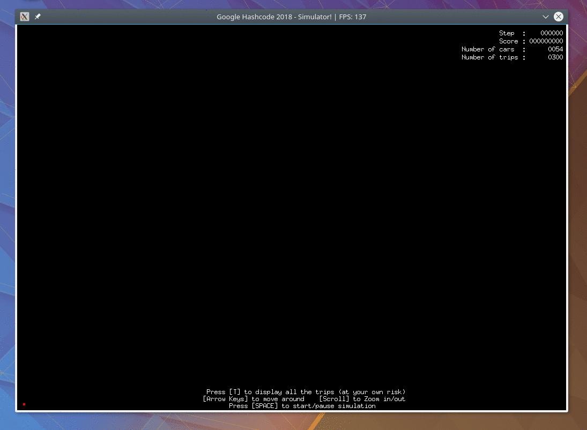

<h1 align="center">Google Hash Code 2018 : live simulation</h1>


<div align="center">

[](https://circleci.com/gh/AkselsLedins/google-hashcode-2018-live-simulation)


</div>

## Preview

<div align="center">



</div>

## Installation

```
$> make deps
$> make
```

## Running


| flag   | required | explanation                                                                               |
|--------|----------|-------------------------------------------------------------------------------------------|
| -o     | :white_check_mark:      | path to the output file you have generated with your program during the hashcode          |
| -i     | :white_check_mark:      | corresponding input file, ex: b_should_be_easy.in                                         |
| -noGui |          | you can run the simulation withtout a graphic interface. This will only output your score |
| -h     |          | display help                                                                              |

#### Example with a Graphic Interface

```
$> ./google-hash-code-2018 -o resources/output-files/b.out -i resources/input-files/b_should_be_easy.in
```


<div align="center">


</div>

#### Example without a Graphic Interface

```
$> go run main.go -o resources/output-files/e.out -i resources/input-files/e_high_bonus.in -noGui
16381105

```


## Graphic interface commands

| Command       | effect                                |
|---------------|---------------------------------------|
| press "space" | pause / start the simulation          |
| press "t"     | shows / hide all the simulation trips |
| arrow keys    | move the camera around                |
| mouse scroll  | zoom in/out                           |


## FAQ

### Why ?
I thought it would be a fun project to practice Go

## Contributing

See <a href="https://github.com/AkselsLedins/google-hashcode-2018-live-simulation/blob/master/CONTRIBUTING.md">Contributing.md</a>.

But basically feel free to contribute if you find something to improve.


## License
[GPL-V3](https://tldrlegal.com/license/gnu-general-public-license-v3-(gpl-3))
